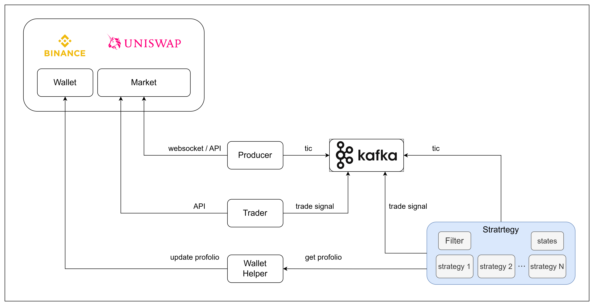

# Quantitative Trading and Backtesting System


## Summary
This project is a modular quantitative trading and backtesting system featuring:

- **Kafka Integration**: Real-time data streaming and communication between services using Apache Kafka.
- **DEX & CEX Support**: Interfaces for both decentralized (DEX) and centralized (CEX, e.g., Binance) exchanges.
- **Strategy Executor**: Flexible framework to register, manage, and execute multiple trading strategies across products.
- **Reinforcement Learning (RL) Strategies**: Support for advanced RL-based trading strategies.
- **Producer Service**: Streams live market data from Binance to Kafka topics for downstream consumption.

## Installation (using `uv`)

1. Install [uv](https://github.com/astral-sh/uv) (if not already installed):

```sh
curl -Ls https://astral.sh/uv/install.sh | bash
```

2. Install dependencies:

```sh
uv pip install --system pyproject.toml
```

## Running with Docker Compose

To start all services (Kafka, Kafka UI, and the producer):

```sh
docker compose up -d
```

- The producer service will stream Binance market data to Kafka.
- Kafka UI is available at [http://localhost:8080](http://localhost:8080) for monitoring topics and messages.

## Stopping Docker Compose

To stop all running services:

```sh
docker compose down
```
---

For more details, see the source code and comments in each module.